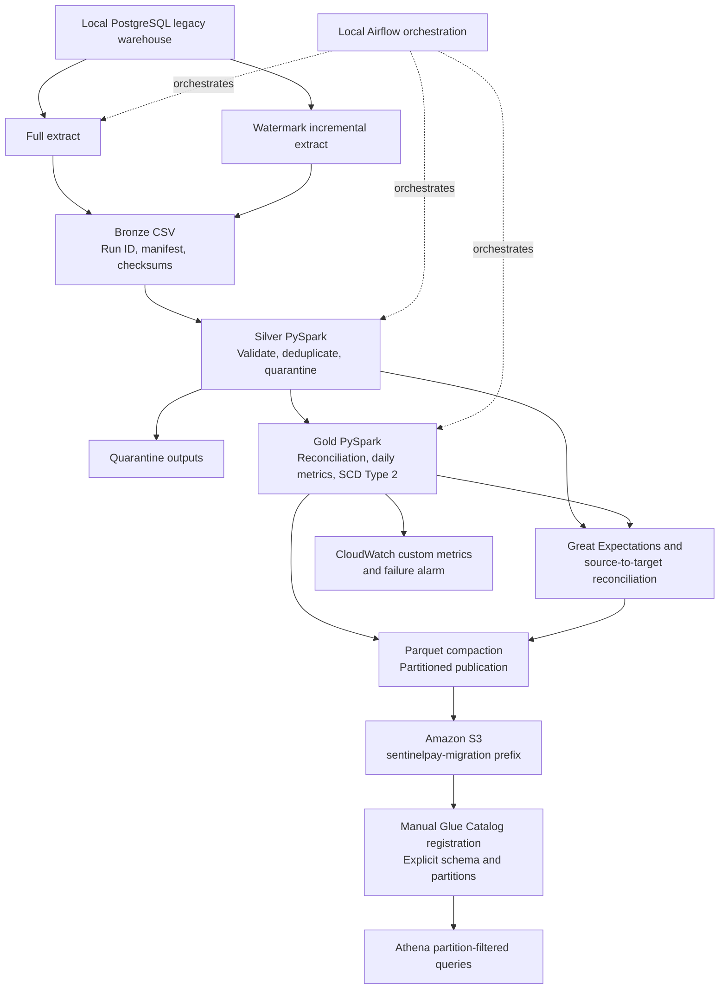

# SentinelPay PostgreSQL-to-AWS Migration

A production-oriented migration simulation for a legacy payments warehouse. It
extracts a local PostgreSQL source, applies PySpark quality controls, produces
analytics-ready Parquet data, and validates the published data through AWS Glue,
Athena, and CloudWatch.

## Architecture



## Completed Implementation

- Local PostgreSQL legacy source with generated merchants, customers, payments,
  and settlements, including intentional quality defects.
- Full and incremental extract scripts that write Bronze data and manifests.
- Silver quality rules: required-field validation, invalid-row quarantine,
  duplicate payment handling, and merchant referential-integrity checks.
- Gold outputs: payment reconciliation, merchant daily metrics, reconciliation
  summary, and Type 2 merchant history.
- Great Expectations validation and source-to-target reconciliation reports.
- Local Airflow DAG for full extraction through reconciliation.
- Parquet compaction to reduce the small-file problem before S3 publication.
- Real S3 publication under the project prefix only.
- Manually defined Glue Catalog tables with partition keys and Athena partition
  repair/query validation.
- CloudWatch namespace `SentinelPay/Migration` with aggregate pipeline metrics
  and a `sentinelpay-migration-pipeline-failed` metric alarm.

## Design Decisions

### SCD Type 2: PySpark, Not dbt

Merchant SCD Type 2 history is intentionally implemented in
`src/transforms/merge_merchant_scd2.py`. The job compares tracked merchant
attributes with null-safe comparisons, closes changed current rows with an
`effective_to` timestamp, and writes a new current version with an incremented
`scd_version`. dbt snapshots are a valid alternative in a warehouse-centric
stack, but dbt is not part of this implementation and is not claimed.

### Retry And Idempotency

Each extract and transform uses a run ID and writes to a new immutable
`run_id=<value>` directory. A rerun with the same ID fails safely through
`errorifexists` output mode instead of silently duplicating data. Incremental
extracts use a per-table `(updated_at, source_key)` watermark, a fixed cutoff
timestamp, atomic manifest/state writes, and batch checksums. Incremental
Silver merges select the latest record per business key; this prevents an
already-seen payment or settlement from creating duplicate current-state rows.

This is rerun-safe output isolation, not a claim of an ACID table format or a
distributed transaction coordinator. A failed run is retried with a new run ID
from the last committed watermark.

### Glue Schema Registration: Manual, Not A Crawler

Glue tables are created manually with an explicit Parquet schema and explicit
partition keys. `MSCK REPAIR TABLE` registers the existing S3 partition
directories after the table is created. A Glue crawler is deliberately not used:
manual registration is deterministic, prevents accidental schema changes, and
avoids additional crawler execution cost. Infrastructure-as-code registration
is a suitable future improvement but is not currently implemented.

## Not Deployed

The following are intentionally not claimed as deployed: AWS DMS, Glue crawler,
managed Glue ETL jobs, Kinesis, Firehose, Redshift, Lambda, dbt, SNS, and an
automated production scheduler. The Spark transformation runs locally; AWS Glue
is used here for the Data Catalog, not as an ETL execution engine.

## Local Setup

Prerequisites: Docker Desktop, Python 3.11+, Java compatible with PySpark, and
an AWS CLI profile only when publishing to AWS.

```bash
cp .env.example .env
python3 -m venv .venv
.venv/bin/pip install -r requirements.txt pyspark pyarrow faker
docker compose up -d
.venv/bin/python src/legacy_source/generate_data.py --reset
```

## Run A Migration Locally

```bash
.venv/bin/python src/ingestion/extract_full_load.py --run-id full-demo

.venv/bin/python src/transforms/bronze_to_silver.py \
  --input-run-id full-demo \
  --run-id silver-demo

.venv/bin/python src/transforms/silver_to_gold.py \
  --input-run-id silver-demo \
  --run-id gold-demo

.venv/bin/python src/reconciliation/reconcile_migration.py \
  --silver-run-id silver-demo \
  --gold-run-id gold-demo

.venv/bin/python src/quality/validate_silver.py \
  --silver-run-id silver-demo \
  --gold-run-id gold-demo
```

To use the local Airflow DAG, install Airflow in a separate virtual environment,
configure `AIRFLOW_HOME`, and place `airflow/dags/sentinelpay_full_migration.py`
in its DAG directory. The DAG runs the project `.venv` Python executable.

## Publish Compact Data To S3

Create an Athena-friendly publication after a successful incremental run:

```bash
.venv/bin/python src/transforms/compact_for_publication.py \
  --silver-run-id silver-incremental-001 \
  --gold-run-id gold-incremental-001 \
  --scd2-run-id gold-scd2-incremental-001 \
  --publication-id migration-v1
```

Preview the upload first. `--execute` is required for any write to S3.

```bash
.venv/bin/python src/deployment/upload_lakehouse.py \
  --bucket YOUR_BUCKET \
  --source data/published/publication_id=migration-v1
```

## AWS Query Validation

The published partitioned datasets are stored as Parquet. Create Glue tables
with the exact schema, mark `partition_year` and `partition_month` as partition
keys, then run Athena repair once per table:

```sql
MSCK REPAIR TABLE silver_payments;
MSCK REPAIR TABLE gold_merchant_daily_metrics;
```

Use partition filters to keep Athena scans small:

```sql
SELECT merchant_id, SUM(payment_count) AS payment_count
FROM gold_merchant_daily_metrics
WHERE partition_year = 2026
  AND partition_month = 9
GROUP BY merchant_id
ORDER BY payment_count DESC
LIMIT 10;
```

## CloudWatch Metrics

The metric publisher reads local audit reports and sends aggregate values only:
`PipelineSuccess`, `RecordsProcessed`, `ValidPayments`,
`QuarantinedRecords`, `ReconciliationPassed`, and
`QualityChecksCompleted`. It sends no source records or personal identifiers.

```bash
.venv/bin/python src/observability/publish_cloudwatch.py \
  --quality-report data/output/silver/run_id=silver-demo/quality_report.json \
  --reconciliation-report data/output/audit/gold_run_id=gold-demo/migration_reconciliation.json \
  --execute
```

The Airflow DAG publishes these metrics after a successful run. Its failure
callback sends `PipelineSuccess = 0`, which is monitored by the CloudWatch
alarm. The IAM policy should permit only `cloudwatch:PutMetricData` for the
`SentinelPay/Migration` namespace.

## Continuous Integration

GitHub Actions runs on every push and pull request using
`.github/workflows/ci.yml`. It installs the development dependencies, compiles
the project Python files, and runs fast unit tests without AWS credentials or
cloud writes. Run the same checks locally with:

```bash
.venv/bin/pip install -r requirements-dev.txt
.venv/bin/python -m compileall -q src airflow/dags
.venv/bin/python -m pytest -q
```

Continuous deployment is intentionally not configured yet. Any future S3
publication workflow must use approval gates and AWS OIDC federation rather
than long-lived AWS keys stored in GitHub.

## Security And Cost Controls

- AWS credentials stay in the named AWS CLI profile, never in `.env` or source
  control.
- The deployment identity is limited to the project S3 prefix and CloudWatch
  metric publication namespace.
- The uploader has a dry-run default and performs no delete cleanup.
- Athena queries should always include partition filters.
- Compaction reduces S3 object count and query-planning overhead.
